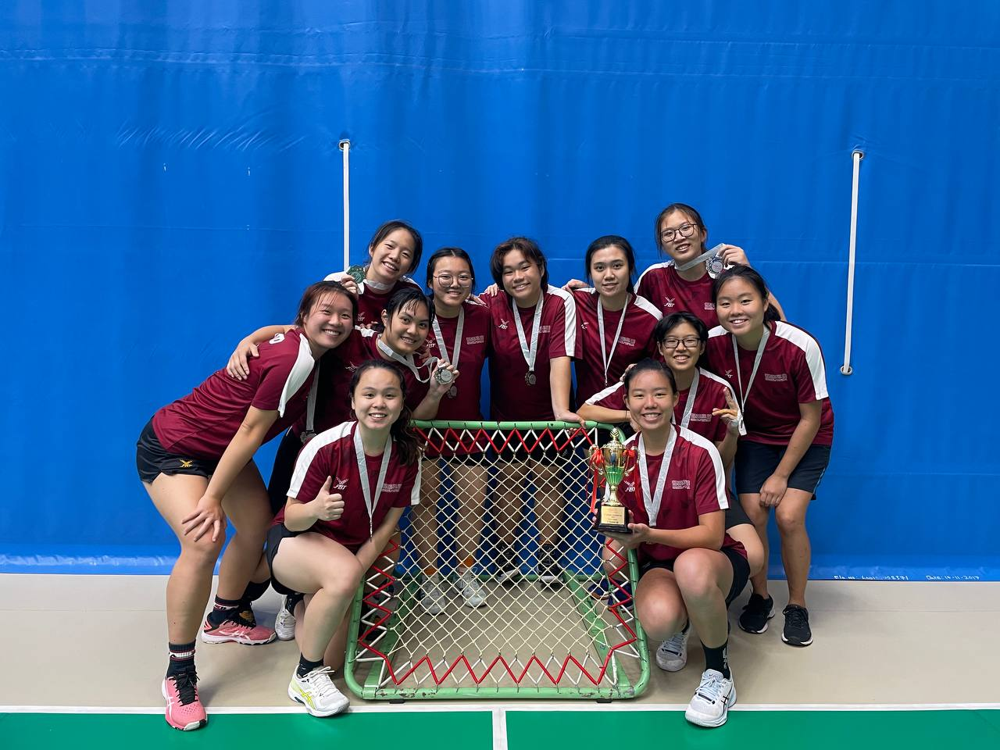
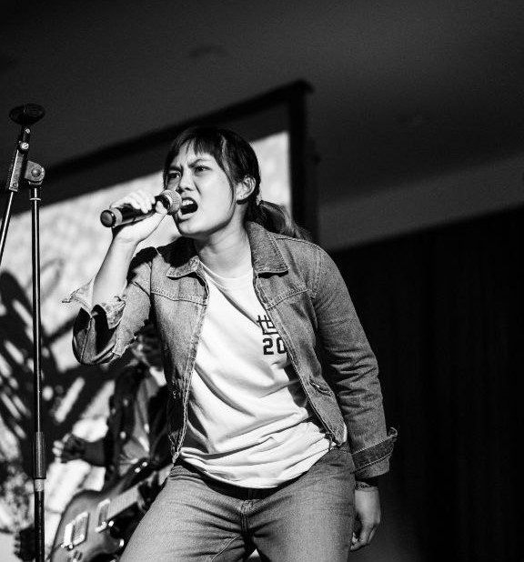
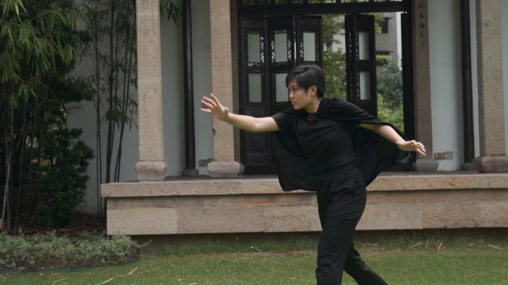

---
title: Adelle's FifthRows/Extracurriculars
filename: fifthrow.md
--- 

# Sunig (Tchoukball)

Tchouk Vice-Pres for 1 year, Tchouk Exco for 2 years. In my time with the club, 
we have attained 1 gold, 1 silver and 1 bronze. We are the first club in SUTD to attain sports podium placing. 
This can largely be attributed to the lack of sportsmen interested in engineering-related subjects. As vice-pres, 
I've had to mediate squabbles, retain club members, and find innovative ways to motivate the team towards upcoming competitions.
======================

# SUTD Bands (Vocalist)

Organized 1 concert and have performed on at least 5 stages throughout my SUTD life. 
Soft skills in teamwork, negotiation and giving nuanced constructive feedback were learnt through this experience.
As the frontman, skills in audience engagement were also picked up. Additionally, it was important to build rapport with the
various organizers in school.
=====================

# SUTD Productions (Actor/Editor)

Edited a full online concert (Springheads 2021), filmed the livestream for Roboclash 2022, acted as the villain in Orientation Videos for 2022 and 2023 