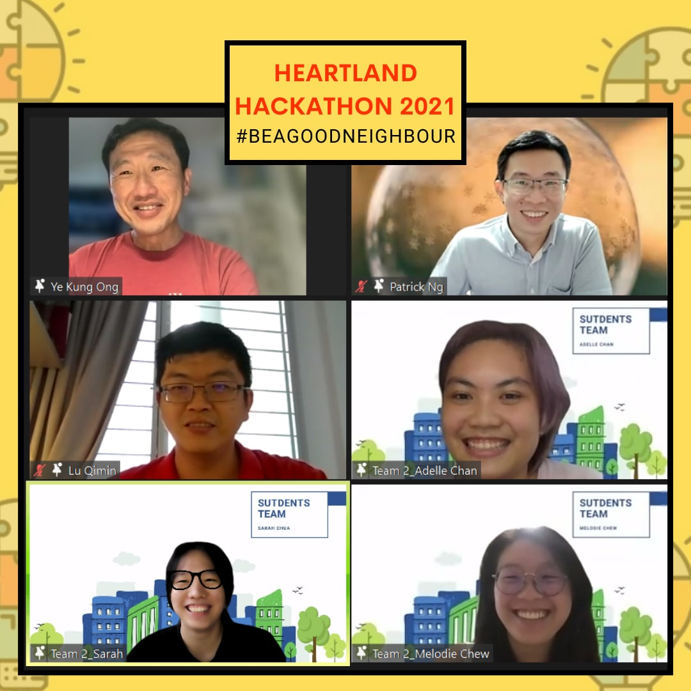
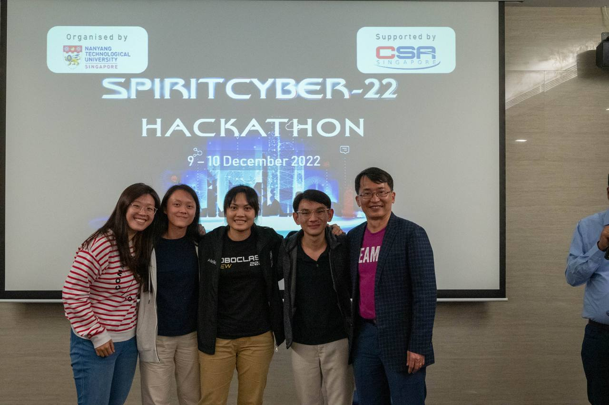
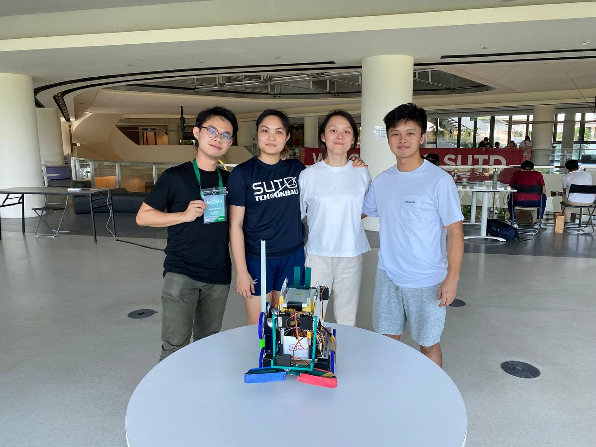

---
title: Adelle's Hackathons/Competitions
filename: hackathons.md
--- 

# Heartland Hackathon (May 2022)

Achieved first place in this hackathon. Our solution targeted the localization of noise pollution in hdbs.
We were able to integrate a cheap solution with a recent research paper, producing the estimated cost of usage. 
Additionally, with ground work interaction with the users of the product (pa staff), we produced a mockup of a sample application with warning.
The project used a basic Grove noise sensor but also considered long term battery lifespan costs while considering placement in corridoors.

# SpiritCyber Hackathon (Dec 2022)

This hackathon was built for future hackers. 
With a group of friends, we learnt a lot infiltrating into various iot firmware strategically placed at the location.
While we did not attain first, we did attain a special mention for strategic engagement with the firmware.

# SOAR Roboclash foodwars (Jan 2023)

Participated in a robotics competition where robots collected as many balls possible to attain the highest number of points. 
We used arduino and many motors to build this robot.