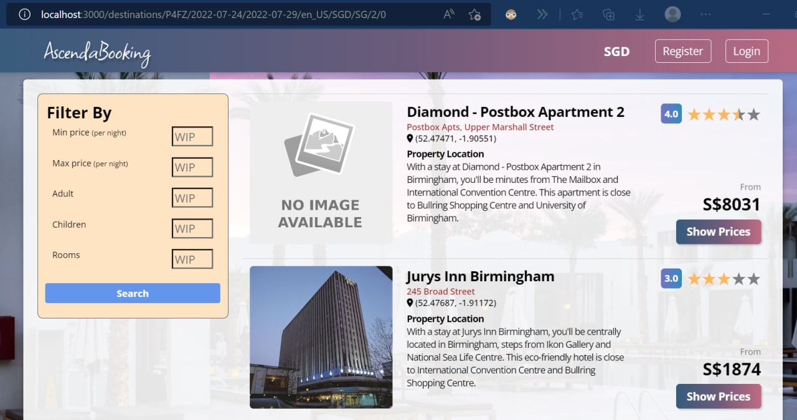
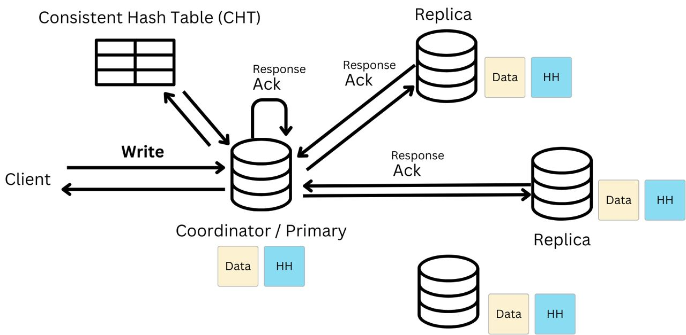
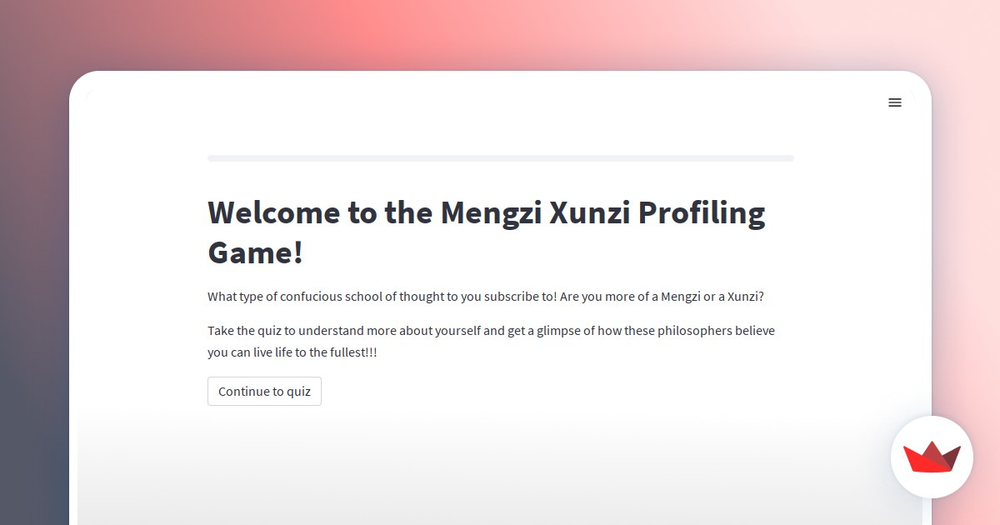

---
title: Technical projects and endeavours
filename: index.md
--- 

# Capstone
In SUTD, the capstone is a final year project executed by a combination of students of different specializations. I worked with 2 engineering devlopment students, and 3 other computer science and design students. 

I was in charge of building the real time data processor. This can be split into 3 parts. 1. The backend data processor in Flink, optimizing the latency of the data and the scalability of our algorithm. 2. The data sink consumer and web socket also had to be expediated. 3. The frontend socket consumer and the visualisations, including a map on leaflet.

https://capstoneshowcase.sutd.edu.sg/project/proj-s32-klass-engineering-personnel-and-artefact-monitoring-system-pams/

# Hotel booking page mockup

`link: https://github.com/dellebew/ESC_Ascenda` (school project)
For this we built a full stack site with the MERN stack (mongo, express, react, node) to mimic a hotel site.
The project had many components, including hotel/destination-based search, frontend cards for hotels, hotel rooms, and various customizations.
There was also a backend component to read from an api, as well as integration with payment mode stripe API.
I was in charge of integration with payment flow. The project also considered software testing including black box, fuzzy and penetration testing. 

# Cassandra mockup

`link: https://github.com/Fruittips/Casserole` (school project)
We rebuilt a stripped version of Cassandra, addressing the parts that make it a resilient distributed system. 
Casserole fulfils eventual consistency and is highly available due to a combination of consistent hash table and usage of replicas.
The project was written in Golang but uses http for it's inter-node communication.

# Digital humanities game exploration 

`link: https://github.com/benjaminchong99/sages`
Grounded in the intention to share our newfound knowledge of 2 famous chinese poets (mencius and xunzi), 
we chose to built a mini personality test instead of writing another essay for our final humanities submission.
The app uses Streamlit and github. Link to the page: `https://xunmengprofilingquiz.streamlit.app/`

# ChatGPT poem generator (Jan 2023)

`link: https://github.com/dellebew/OH2023_chatbot` (non-school project) 
This was a fun little project we built for SUTD's open house in 2023. 
To help people understand the different flavours of poems: both eastern and western,
customizable questions were built via prompt engineering to encourage related questions by the masses. 
The interface was built with Streamlit and integration was done with openai. 

